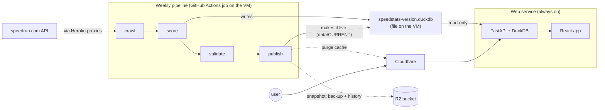
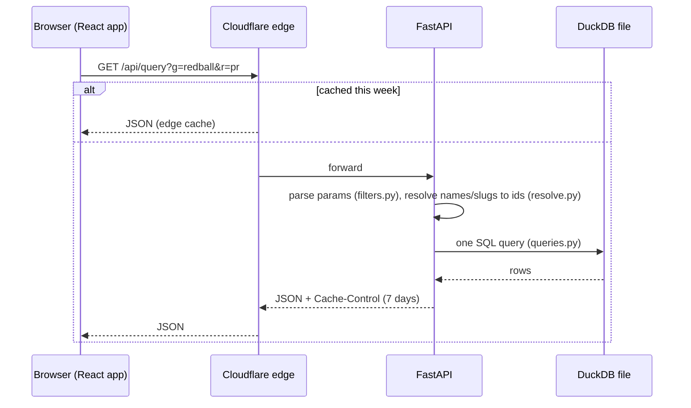
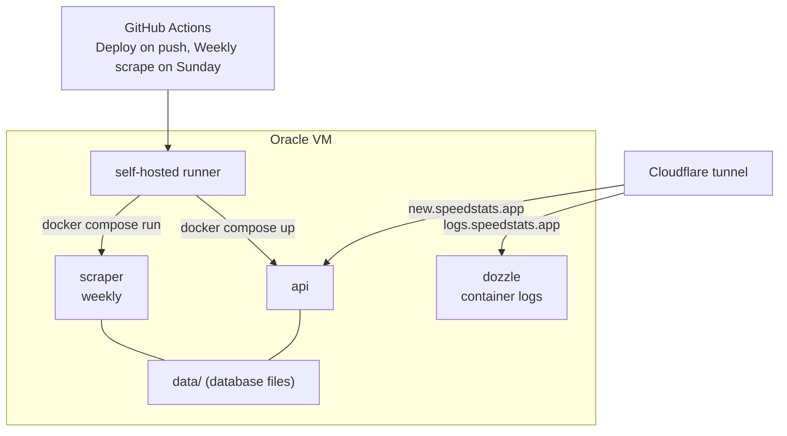

# SpeedStats architecture

SpeedStats turns every verified run on speedrun.com into a point value and lets you rank players, games,
series, platforms and locations by those values. It has two halves that never talk to each other directly:
a **weekly pipeline** that produces one database file, and a **web service** that serves queries from it.



## The pipeline (`scraper/`)

`python -m scraper all` runs the four stages; each one is also a separate command.

| stage | what it does | output |
|---|---|---|
| **crawl** (`crawl.py`) | Lists all series and games, then fetches every game's data and every leaderboard page. Requests go through a pool of proxies (`proxy_pool.py`, one IP each; speedrun.com allows 500 requests per 20-minute window per IP, so each proxy spends its budget then waits for its window to end). Rows are appended as they arrive; a checkpoint per game makes a crashed crawl resumable. | `data/work/crawl-<version>.duckdb` (raw tables: `raw_runs`, `raw_players`, `raw_games`, ...) |
| **score** (`sql/normalize.sql`, `sql/score.sql`) | Builds each leaderboard (best run per player set), computes the value of every run with the [formula](https://www.desmos.com/calculator/uvredthnmv), credits it to the players, and precomputes the all-games player ranking. Pure SQL, runs in ~30 s for 5M runs. | `data/speedstats-<version>.duckdb` (`runs`, `player_ranks`, lookup tables, `meta`) |
| **validate** (`validate.py`) | Sanity gates: enough leaderboards, no errored games, row/game/player counts and total value close to last week, top-100 mostly unchanged, smoke queries. | pass / fail + a report in the GitHub job summary |
| **publish** (`publish.py`) | Writes the new file's name into `data/CURRENT` (a one-line text file next to the databases, replaced atomically), waits for the API to pick it up, purges the Cloudflare cache, uploads a parquet snapshot to R2, prunes old files. | live data |

If validation fails, nothing is published and last week's data keeps serving.

**Why one DuckDB file?** The data changes once a week and every query is an aggregation over up to a few
million rows. DuckDB answers those in milliseconds straight from the file, there is no database server to
run, and "deploying data" is just writing a new file and moving a pointer.

**Why the R2 bucket?** The VM is disposable; the bucket is the copy that outlives it. Every publish also
uploads the published tables as parquet to `snapshots/<version>/` (plus `snapshots/latest/`), so a new VM
or a developer laptop can `python -m scraper bootstrap` the latest data instead of re-crawling, and past
weeks stay available for future features such as rank history. Snapshots are small (tens of MB) and R2's
free tier covers them.

## The web service (`api/`, `web/`)



- **`speedstats/filters.py`** parses the query string: one-letter keys (`s`, `g`, `p`, `u`, `l`, `r`, `m`) with
  comma-separated terms, plus the original site's long keys (`games=Red+Ball%2C+Red+Ball+2&request-type=pr`)
  so its links keep working; a leading `!` excludes a term. `web/src/query.ts` is the same logic in TypeScript
  so the app can build identical URLs.
- **`api/resolve.py`** turns each term into ids: name or speedrun.com slug for games/series/platforms/players,
  continent name (`speedstats/continents.py`, our own table since speedrun.com has none) or any speedrun.com
  area at any depth by id, name or full name for locations (`us`, `Colorado`, `England`); a matched area covers
  everything under it, filtered through `players.area_id` so the published schema is unchanged.
- **`api/queries.py`** holds the seven request types. All share one `scope` CTE:
  `(series ∪ games ∪ platforms) − exclusions`, restricted by players and locations.
- **`api/db.py`** keeps a read-only connection to the current file and hot-swaps it within 10 s of
  `data/CURRENT` changing - a publish never restarts the API.
- **`web/`** is a Vite + React app. All state lives in the URL, so every view is a shareable link. The API
  also serves the built app and injects `<title>`/`og:` tags per query so links preview well in Discord.

## Where things run



Nothing needs ssh after the one-time `ops/vm-setup.sh`: deploys and scrapes are GitHub Actions runs (logs,
re-run, summary in the Actions tab), container logs are at `logs.speedstats.app` (behind Cloudflare Access),
secrets are GitHub Actions secrets that the Deploy workflow writes to the VM's `.env`.

## Repository map

```
speedstats/   settings and query-string parsing shared by scraper and API
scraper/      crawl.py, src_client.py, proxy_pool.py, writer.py, score.py, validate.py, publish.py, sql/
api/          main.py (routes), db.py, resolve.py, queries.py, schemas.py
web/          React app (src/query.ts mirrors speedstats/filters.py)
tests/        pytest; tests/fixtures/crawl.json is a real small crawl, expected-*.csv its golden scoring
tools/        regression.py (compare with the live site), update_golden.py
ops/          vm-setup.sh
.github/      ci.yml, deploy.yml, scrape.yml
```
